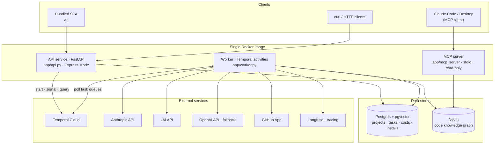
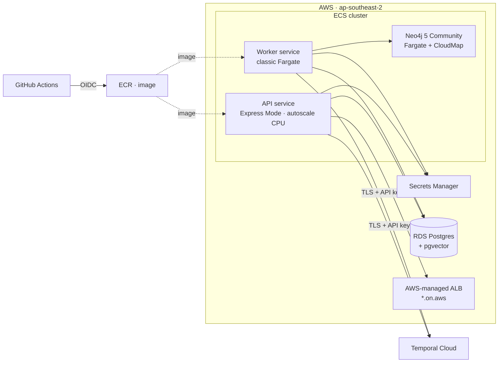
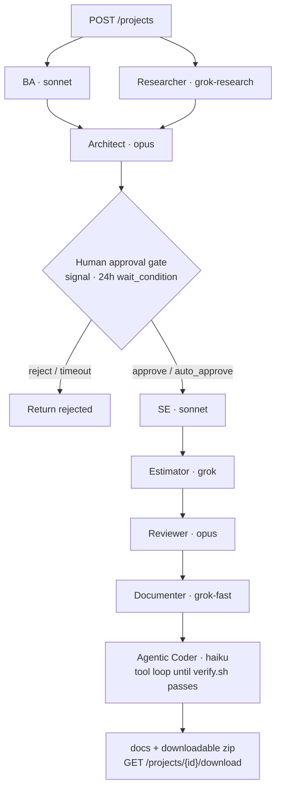
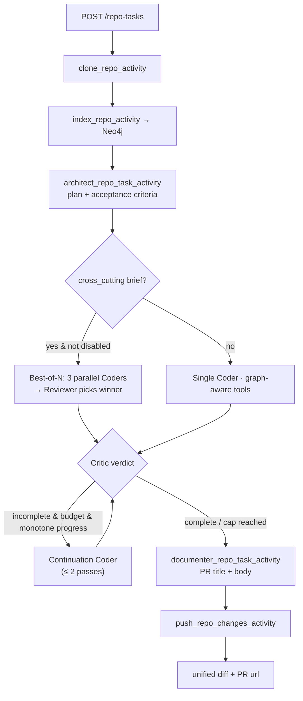
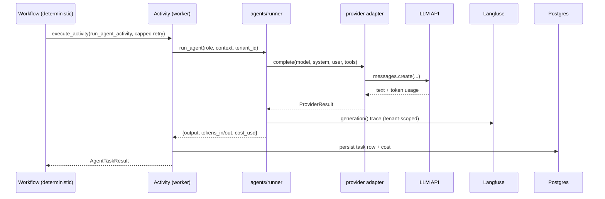
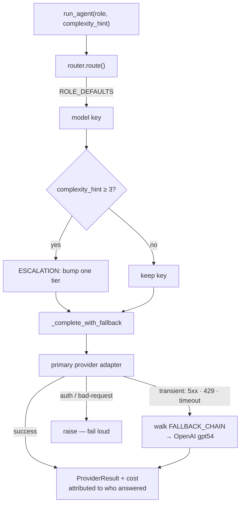
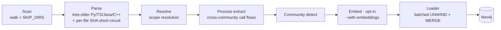
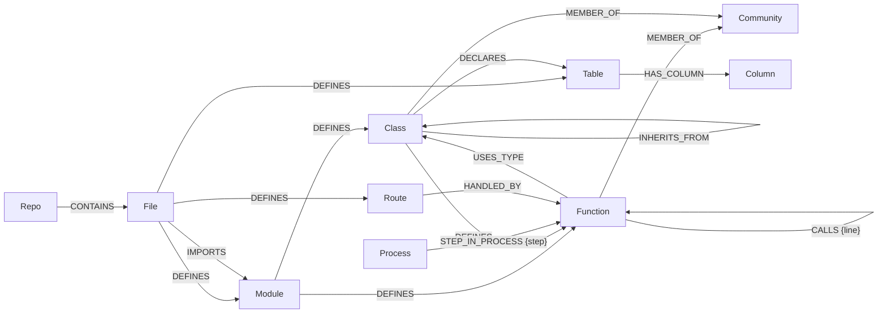
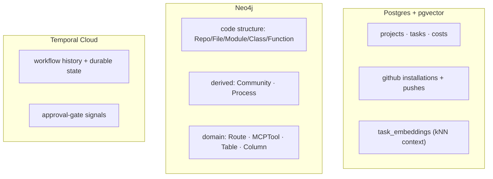

# TW AI Swarm

A one-person version of a Temporal-based multi-agent system. Temporal stays; everything else is collapsed to one image, two services.

Repo: [`cintelis/twai-swarm`](https://github.com/cintelis/twai-swarm). AWS resource prefix is `lean-agent` (the original project name; kept as the resource name to avoid a destructive rename).

## What's in here

```
.
├── app/                          Python app (API + worker + agents)
│   ├── api.py                    FastAPI intake
│   ├── worker.py                 Temporal worker (all role queues)
│   ├── workflows/project.py      ProjectWorkflow orchestrator
│   ├── activities.py             DB + LLM side effects
│   ├── agents/runner.py          Agent prompts + Claude invocation
│   ├── router.py                 Haiku/Sonnet/Opus selection
│   ├── db.py                     Async Postgres (tasks + pgvector)
│   ├── config.py                 Env vars, Temporal Cloud TLS
│   └── bootstrap_db.py           One-shot schema init (used by Terraform)
├── db/init.sql                   Local Postgres schema
├── docker-compose.yml            Local dev stack
├── Dockerfile                    Single image for API + worker
├── Makefile                      Dev shortcuts (make help)
├── deploy/
│   ├── ecs/worker-task-def.json  Generated by Terraform
│   └── terraform/                IaC for the whole AWS stack
└── .github/workflows/            CI + deploy pipelines
```

## Local dev

```bash
cp .env.example .env          # add ANTHROPIC_API_KEY and XAI_API_KEY
make up                        # Temporal + Postgres in docker
make api                       # terminal 2
make worker                    # terminal 3

# Kick off a project (approval gate enabled by default)
curl -X POST http://localhost:8000/projects \
  -H 'content-type: application/json' \
  -d '{"name":"demo","brief":"Build a CLI tool that summarises git commits"}'

# ... wait until GET /projects/{id} shows awaiting_approval=true ...

# Approve to continue the pipeline
curl -X POST http://localhost:8000/projects/{workflow_id}/approve

# Or reject with a reason
curl -X POST http://localhost:8000/projects/{workflow_id}/reject \
  -H 'content-type: application/json' -d '{"reason":"pivot to different approach"}'

# See total spend + per-model breakdown
curl http://localhost:8000/projects/{workflow_id}/costs

# For unattended runs (tests, batch), skip the gate:
curl -X POST http://localhost:8000/projects \
  -H 'content-type: application/json' \
  -d '{"name":"batch","brief":"...","auto_approve":true}'
```

Watch workflows at http://localhost:8080 (Temporal Web UI). The approval wait shows up as a pending `wait_condition` — the workflow genuinely sleeps, no polling.

## Pipeline

```
BA + Researcher  (parallel)
      ↓
  Architect
      ↓
  ⏸  APPROVAL GATE  ⏸   ← POST /projects/{id}/approve or /reject (24h timeout)
      ↓
      SE
      ↓
  Estimator       ← effort hours, cost, risks, assumptions
      ↓
  Reviewer        ← reviews both plan and estimates
      ↓
  Documenter
```

Seven agents, two providers (Anthropic + xAI/Grok 4.20). Router in `app/router.py` shows exactly which model each role picks and why.

## System architecture

The system is **one Docker image run as two roles** (an API service and a Temporal worker), plus a self-hosted **MCP server** that exposes the code graph. State lives in two databases — **Postgres + pgvector** (projects, tasks, costs) and **Neo4j** (the code knowledge graph) — with **Temporal Cloud** providing durability. The diagrams below break the system down sub-component by sub-component.

### Sub-component overview



| Sub-component | Module | Responsibility |
|---|---|---|
| **API service** | `app/api.py` | Thin intake + bundled SPA. Starts/queries/signals workflows, serves cost + status, zips/downloads scaffolds, drives the GitHub App push flow. Auth via `app/auth.py`. |
| **Worker** | `app/worker.py` | Registers all role queues + the `project-workflows` queue; runs every activity. One image scales per-role by narrowing `TEMPORAL_QUEUES`. |
| **Workflows** | `app/workflows/` | Deterministic orchestrators — `ProjectWorkflow` (greenfield) and `RepoTaskWorkflow` (existing code). No I/O. |
| **Activities** | `app/activities.py` | All side effects: DB writes, LLM calls, clone/index/push. |
| **Agents** | `app/agents/` | Role prompts + the agentic/one-shot Coders. Pure functions, no Temporal imports. |
| **Router** | `app/router.py` | Single source of truth for model strings, pricing, role defaults, escalation, and the fallback chain. |
| **Providers** | `app/providers/` | Thin adapters (`anthropic`, `xai`, `openai`) behind a shared `complete()` interface. |
| **Repo indexer** | `app/repo_indexer/` | tree-sitter → scope resolution → communities → embeddings → Neo4j. |
| **Repo query / MCP** | `app/repo_query.py`, `app/mcp_server/` | Read layer over Neo4j (BM25 + vector) and its MCP surface. |
| **GitHub App** | `app/github_app.py`, `app/github_webhook.py` | Installation tokens, branch/PR pushes, webhook HMAC verification. |
| **Observability** | `app/observability.py`, `app/telemetry.py` | Langfuse traces + OpenTelemetry metrics. Both no-op when unconfigured. |
| **Tenancy** | `app/tenant.py` | `tenant_id` threaded through workflows → activities → agents → traces → DB. |

### Deployment topology (AWS · prefix `lean-agent`)



The API/worker split is deliberate: Express Mode is built for stateless HTTP (autoscale on CPU), while the worker is long-lived gRPC queue polling (scale on queue depth). See the [deployed architecture rationale](#architecture-deployed) below.

### Pipeline 1 — `ProjectWorkflow` (greenfield: brief → scaffold)



The approval gate is a genuine Temporal `wait_condition` — the workflow sleeps (no polling) until `POST /approve` / `/reject` or the 24h timeout. The Coder bypasses the router (Anthropic-SDK tool-runner) and falls back to a one-shot JSON generator if the loop errors.

### Pipeline 2 — `RepoTaskWorkflow` (existing repo → PR)



Both workflows are started on the `project-workflows` task queue; the per-role queues in `config.QUEUES` are used only for the individual agent *activities*.

### Agent activity — the determinism boundary

Workflows stay deterministic (no I/O, no clock, no randomness); every side effect is an activity. A single agent turn:



`LLM_RETRY_POLICY` caps attempts at 3 (the Temporal default is infinite backoff, which re-bills full token counts). Auth/bad-request errors are non-retryable.

### LLM routing & provider fallback



`router.MODELS` is the one place model strings *and* pricing live, so routing decisions and cost telemetry share a single source of truth.

### Repo indexer pipeline



Phases are `Phase` objects driven by `runner.run_pipeline` over a mutable `PhaseContext`. Re-scans are incremental via per-file SHA; `force_reindex=True` bypasses the short-circuit after an extractor-version bump. Optional **domain extractors** add HTTP routes, MCP tool/resource registrations, and ORM tables/columns.

### Neo4j graph schema

All nodes are scoped by `repo` (composite uniqueness keys); `tenant_id` rides as a property. Loader writes are idempotent `MERGE`s.



> Domain-extractor nodes `Route`, `MCPTool`, `MCPResource`, `Table`, and `Column` only appear when the matching extractor is enabled. `MCPTool`/`MCPResource` mirror `Route`: `(File)-[:DEFINES]->(node)` and `(node)-[:HANDLED_BY]->(Function)`.

Read access goes through `app/repo_query.py` (hybrid BM25 full-text + cosine vector search) and is exposed read-only over MCP (`query`, `context`, `find_symbol` tools; `twai://repo/<name>/*` resources).

### Where state lives



## Deploying to AWS

### One-time setup

1. **Temporal Cloud account** — [temporal.io/cloud](https://temporal.io/cloud). Create a namespace, then generate an API key from the namespace settings. Free tier is enough for a solo project.

2. **Copy the tfvars template and fill it in:**
   ```bash
   cd deploy/terraform
   cp terraform.tfvars.example terraform.tfvars
   $EDITOR terraform.tfvars
   ```

3. **First apply — provision infrastructure:**
   ```bash
   make tf-init
   make tf-apply
   ```

   The first apply will fail at the DB bootstrap step because the image doesn't exist in ECR yet. That's expected — move on to step 4.

4. **Push the image:**
   ```bash
   make push     # builds, tags, pushes :latest to the new ECR repo
   ```

5. **Second apply — runs the DB bootstrap now that the image exists:**
   ```bash
   make tf-apply
   ```

6. **Wire up GitHub Actions:**
   ```bash
   terraform output github_deploy_role_arn
   ```
   In your GitHub repo settings → Secrets and variables → Actions, add:
   - `AWS_DEPLOY_ROLE_ARN` = the ARN from above

   Push to `main`. The deploy workflow takes over from here.

### Ongoing deploys

Just push to `main`. The workflow:
- Builds the image tagged with the commit SHA
- Pushes to ECR
- Rolls the worker service (classic Fargate — renders task def, deploys)
- Rolls the API service (Express Mode — uses `aws-actions/amazon-ecs-deploy-express-service`)
- Smoke-tests `/health`

## Architecture (deployed)

```
GitHub Actions ──OIDC──▶ AWS
                         │
                         ├── ECR (image)
                         ├── Secrets Manager (4 secrets)
                         ├── RDS Postgres + pgvector
                         │
                         └── ECS cluster
                             ├── Express Mode: API service ──▶ AWS-managed ALB (*.on.aws)
                             └── Fargate:      Worker service ──▶ (no ALB)

                         Both services ──TLS+API key──▶ Temporal Cloud
                                       ──HTTPS─▶ api.anthropic.com
```

**Why the split?** Express Mode is built for stateless HTTP; the worker is long-lived gRPC polling. Forcing them both into Express would mean autoscaling workers on the wrong signal (HTTP rate vs queue depth). The two-service split is ~20 lines of extra Terraform and matches the tool to the job.

## Scaling knobs

- **Worker throughput per role**: copy the worker service in Terraform, set `TEMPORAL_QUEUES=architect` (or any comma-sep subset), scale independently. No code changes.
- **API**: handled by Express Mode autoscaling on CPU (target 70%). Range 1–5 tasks.
- **DB**: upgrade `db_instance.pg` to `t4g.small` + multi-AZ when needed.
- **Add vector retrieval**: wire an embed-on-complete activity, extend `db.get_ancestor_outputs` with a kNN query against `task_embeddings`.
- **Add Langfuse**: wrap the Anthropic call in `agents/runner.py` with their decorator.

## Cost estimate (idle)

| Resource | ~Monthly |
|---|---|
| RDS t4g.micro single-AZ | $15 |
| Fargate (API 0.5vCPU + worker 1vCPU 24/7) | $35 |
| ALB (Express-managed, shareable) | $18 |
| Secrets Manager (4 × $0.40) | $2 |
| Logs, data transfer | $5 |
| Temporal Cloud (free tier) | $0 |
| **Total** | **~$75** |

Jumps with traffic as workers autoscale and the API scales up.

## Troubleshooting

**Worker can't connect to Temporal Cloud**
Check the host format in Terraform vars — it's `namespace.accountId.tmprl.cloud:7233`, no `https://` prefix. CloudWatch logs for the worker service (`/ecs/lean-agent` → `worker` stream) will show the connection attempt.

**Bootstrap task fails on first apply**
Normal. The image hasn't been pushed yet. Run `make push`, then `make tf-apply` again.

**Express service URL returns 503**
Tasks may still be warming up. ECS Express health check grace period is 30s. Wait a minute; check CloudWatch for app errors if it persists.

**GitHub Actions can't assume role**
Double-check `AWS_DEPLOY_ROLE_ARN` secret matches the Terraform output, and that `github_repo` in tfvars matches your actual repo name exactly.
